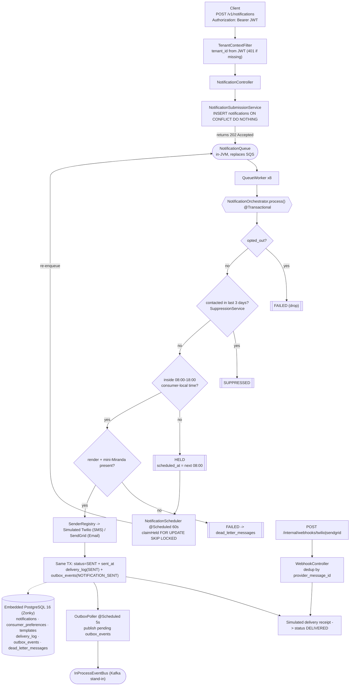

# Notification Service — Flow

Message lifecycle, compliance gates, and background processes. (Render with any Mermaid viewer.)

Entry points that drive the orchestrator: the REST API (JWT), the bundled TUI (`java -jar … tui`),
and the demo/admin endpoints (`/internal/seed`, `/internal/demo/load`).
